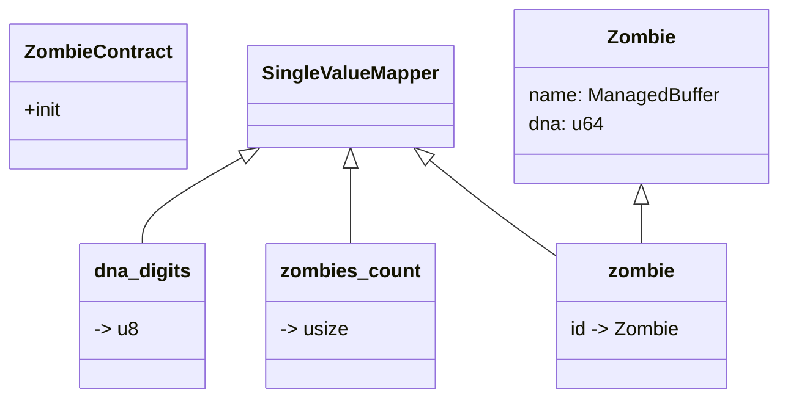

# CrytoZombies course 

### https://cryptozombies.io/en/multiversx  

### Smart Contract Diagram:

```mermaid
classDiagram
    class ZombieContract{
        +init 
    }
    class SingleValueMapper
    SingleValueMapper <|-- dna_digits
    class dna_digits {
        -> u8
    }
    SingleValueMapper <|-- zombies_count
    class zombies_count {
        -> usize
    }
    SingleValueMapper <|-- zombie
    class zombie {
        id ->        Zombie
    }
    class Zombie {
        name: ManagedBuffer
        dna: u64
    }
    Zombie <|-- zombie

```

 